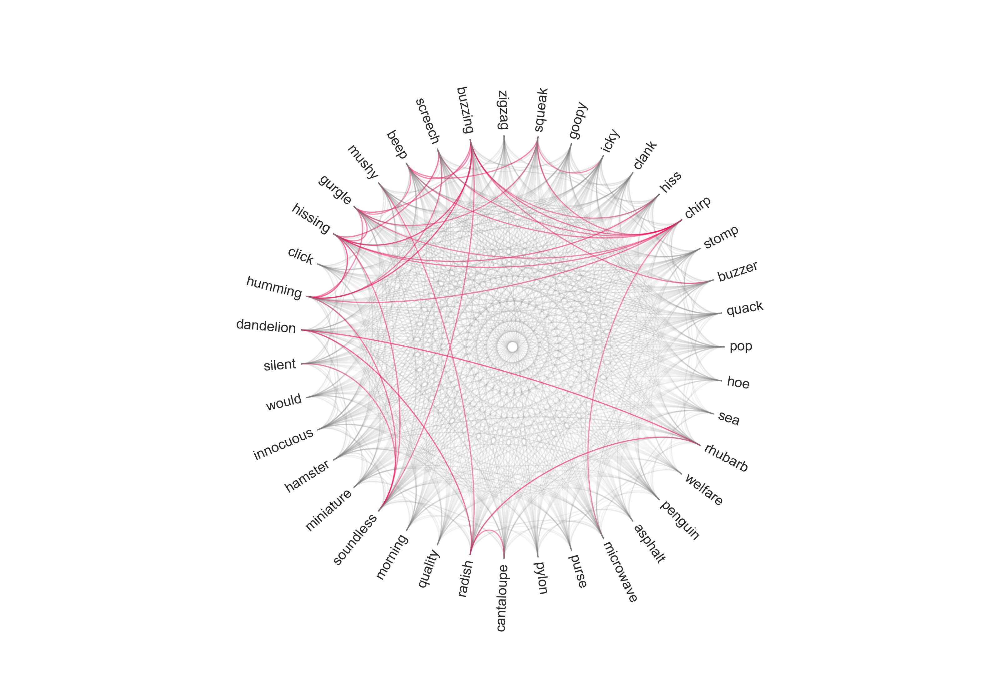

## A Few Computational Semantics Utilities

**Author**: Bill Thompson (billdthompson@berkeley.edu)



#### Summary
This repository contains a few utilities for computing and visualizing semantic networks.

---

#### Computing a Network

Use ```get-net.py``` to compute a semantic network as follows:

1. Clone this repository.
2. Make a csv that includes a column ```word``` containing the terms you are interested in. Put that csv in this directory. 
3. Obtain a .vec format semantic model for the language you are interested in, such as the Facebook-released model [(link)](https://s3-us-west-1.amazonaws.com/fasttext-vectors/wiki.en.vec) for English trained on wikipedia, and place it in this directory.
4. If you called your wordlist ```wordlist.csv```, and you are using the ```wiki.en.vec``` semantic model, for example, run:

 ```python get-net.py -f wordlist.csv -v wiki.en.vec``` 

This will result in three new files: ```network-matrix.txt```, which is the symmetric matrix of cosine similarities between all wordlist terms for which word vectors are availible in the semantic model; ```network-index.csv```, which indexes the rows and columns of the similarity matrix; and ```network-lf.csv```, which is a long-form representation of all unique non-identical pairs of words and their cosine similarities. Bear in mind that the running time of this script grows exponentially in the number of terms in your list. 

The model wrapper contained in ```skipgram.py``` provides a simple way to interface with .vec files generally.

---

#### Visualising a Network

Use ```radial.py``` to visualise a semantic network in like the radial network at the top of this document (which shows semantic similarities between the 20 most and least iconic words in English according to [Winter at al.](https://benjamins.com/#catalog/journals/is.18.3.07win/details)). This script is ugly, but should be relatively straightforward to use if you know python, matplotlib, and pandas at all.   

1. Clone this repository.
2. Compute a semantic network following the steps above, or provide your own long-form network file with three columns: ```w1```, ```w2```, ```cosine_similarity```.
3. Run:

```python radial.py -f network-longform.csv -h```

This will save out a pdf image ```network-radial.pdf``` of the network. The ```-h``` flag tells the script to highlight any connections whose similarity is larger than the mean plus twice the standard deviation in this dataset. There are a few tweakable parameters in inside the script itself.
